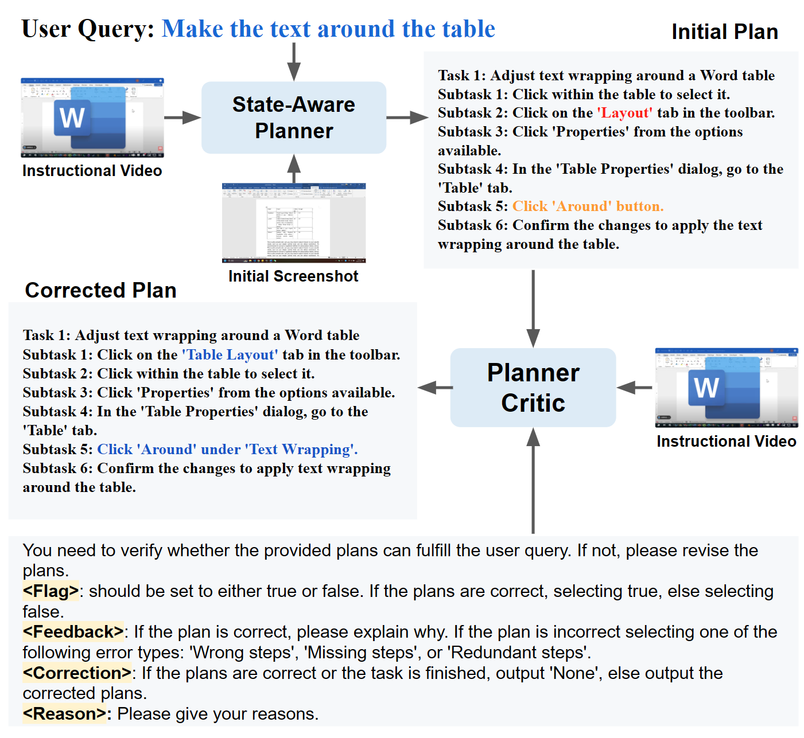
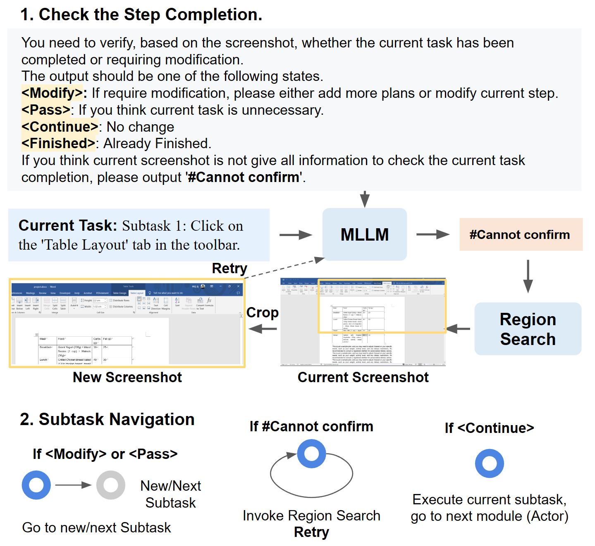
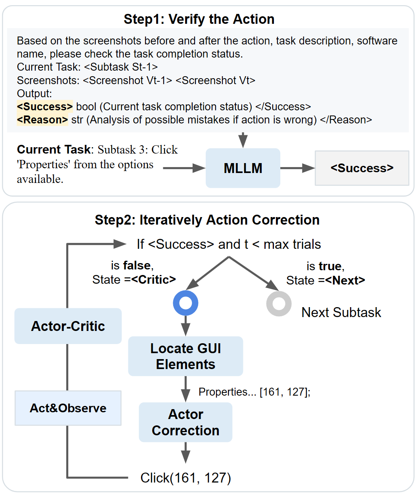
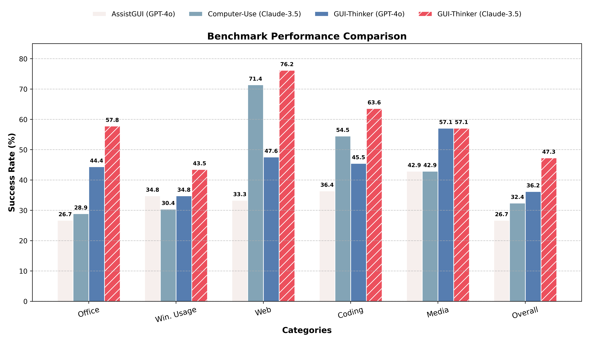

<div align="center">
  
</div>  

<h5 align="center"> 
Welcome to GUI-Thinker! If you find this repo useful, please give a star ⭐ for encouragement.
</h5>

<h5 align="center"> 

English | [中文](README_zh.md)

[](https://arxiv.org/abs/2502.08047)
[](https://showlab.github.io/GUI-Thinker)
[](https://github.com/showlab/Awesome-GUI-Agent)
[](https://hits.seeyoufarm.com)

</h5>


##  Overview

**GUI-Thinker** has highly adaptive self-reflection capabilities in dynamic GUI envs.

**No Docker or Virtual Machine** for deployment.

Visit our study WorldGUI in [project page](https://showlab.github.io/GUI-Thinker).🌐


User Query: Disable the 'Battery saver' Notifications

GUI-Thinker:

<p align="center" style="margin:0"></p>

## Introduction
<details>
<summary>What's new in GUI-Thinker?</summary>

**GUI-Thinker** is a newly developed GUI agent based on a self-reflection mechanism. We systematically investigate GUI automation and establish the following workflow, incorporating three key self-reflection modules:

- Planner-Critic (Post-Planning Critique): Self-corrects the initial plans to ensure their accuracy

- Step-Check (Pre-Execution Validation): Remove redundant steps or modify them if necessary.

- Actor-Critic (Post-Action Evaluation): Review the task completion status and apply necessary corrections.

### Technique Details

<p align="center" style="margin:0"></p>

<p align="center" style="margin-top:-0.5em">Overall framework of GUI-Thinker.</p>

<p align="center" style="margin:0"></p>
<p align="center" style="margin-top:-0.5em">State-Aware Planner and Planner-Critic modules.</p>

<p align="center" style="margin:0"></p>

<p align="center" style="margin-top:-0.5em" >Step-Check module.</p>

<p align="center" style="margin:0"></p>

<p align="center" style="margin-top:-0.5em">Actor-Critic module.</p>


### Comparing with SOTA Desktop GUI Agent

<p align="center" style="margin:0"></p>

<p align="center">Comparison of various agents on the WorldGUI Benchmark (meta task).</p>

</details>

## 📢 Update
* [2025.03.11] ⚡ We are excited to introduce **a fast version of GUI-Thinker** powered by the base models [Claude-3.5-Sonnet](https://www.anthropic.com/news/3-5-models-and-computer-use) and [Claude-3.7-Sonnet](https://www.anthropic.com/news/claude-3-7-sonnet). In this release, the Claude models serve as the Actor without relying on the GUI Parser. This setup delivers impressive speed. Try with [test_guithinker_fast.py](./test_guithinker_fast.py).
* [2025.03.08] We made a demo for showing the GUI-Thinker.
* [2025.03.05] ⚡ Our GUI-Thinker now supports both [instructional video](https://github.com/showlab/WorldGUI/tree/main?tab=readme-ov-file#-test-with-a-prepared-demo-case-under-the-folder-data) and [non-video](https://github.com/showlab/WorldGUI/tree/main?tab=readme-ov-file#-test-with-your-own-user-query) inputs. Enjoy!
* [2025.03.05] 😊 We release the code of GUI-Thinker. Now, we support running our GUI agent on your Windows computer locally [Getting started](https://github.com/showlab/WorldGUI/tree/main?tab=readme-ov-file#-getting-started-with-computer-use-agent-gui-thinker). GUI-Thinker now supports various base LMMs through API calling, including GPT-4o, Gemini-2.0, and Claude-3.5-Sonnet. Local model support will be available soon.

* [2025.02.13] We release the WorldGUI in [arxiv](https://arxiv.org/abs/2502.08047).

## ✨Key Features

- 🏆 **High Performance**: Our GUI-Thinker surpasses Cluade-3.5 Computer Use by 14.9% on our WorldGUI Benchmark.
- 🌐 **Universal LMM Support**: Seamlessly integrates with **A Wide Range** of LMMs (e.g., OpenAI, Anthropic, Gemini)
- 🔀 **Flexible Interaction**: Supports both **intructional video input** and **non-instructional video input**.
- 🚀 **Easy Deployment**:  Get started instantly with a simple `.\shells\start_server.bat` command and `python test_guithinker_custom.py` without the need of Docker or Virtual Machine.

## 🤖 Core Components:
Our codebases includes:

- [x] **GUI Parser:** Utilizes Google OCR and PyAutoGUI to extract element grounding information.
- [x] **State-Aware Planner:** Accepts screenshots and instructional videos to generate plans.
- [x] **Planner-Critic:** Refines the initial plan generated by the planner.
- [x] **Step-Check:** Verifies task completion and redundancy using various output statuses (e.g., `<Modify>`, `<Pass>`, `<Continue>`, `<Finished>`). It also implements an LLM-driven region search module to locate target elements.
- [x] **Actor:** Translates action descriptions into executable code (e.g., `click(100, 200)`). It can be any API models or locally running models.
- [x] **Actor-Critic:** Checks task completion status by comparing before and after screenshots and uses an iterative action correction algorithm to gradually verify and correct actions.
- [x] **Input with Instructional Video:** Supports the execution with instructional video.
- [x] **Input without Instructional Video:** Supports the direct execution with user query.
- [x] **Frontend-backend communication system:** Supports seperate the frontend and backend for flexible deploying the locally running model and user interfaces.


See our [paper](https://arxiv.org/abs/2502.08047) for detail. Our GUI-Thinker is along with a newly curted Desktop GUI benchmark WorldGUI.

## ✅ Todo List

GUI-Thinker is continuously evolving! Here's what's coming:

- [x] ⚡ **Fast Version**: Supporting a fast version specially equipped with anthropic Computer Use without the GUI parser.

- [ ] 👓 **OOTB Usage**: Supporting a user-frendly interface based on Gradio.

- [ ] 📊 **Locally-running Models**: Supporting the ShowUI or UI-TARS as the Actor in our framework.

- [ ] 🎨 **Huggingface Demo**: Developing online demo in Huggingface.

Feel free to open issues or submit pull requests if you have suggestions. Our project is actively maintained, with new features and bug fixes released regularly. 🚀


## 🖥️ Demo of Computer Using

Demo Video (The video has been sped up):

https://github.com/user-attachments/assets/5d25c079-4c84-4435-8280-591f32f89700

See 1080p version from https://www.youtube.com/watch?v=RoJ-cbjfZmg


## 🚀 Getting Started


See [Get Started](./Get%20Started.md) for local computer running.

## ❤ Acknowledgement
- Special thanks to [Difei Gao](https://scholar.google.com/citations?user=No9OsocAAAAJ&hl=en) for his hard work on devleoping the codebase.

- We express our great thanks to Kaiming Yang, Mingyi Yan, Wendi Yu for their hard work for data ananotation and baseline testing.

- [OOTB (Computer Use)](https://github.com/showlab/computer_use_ootb?tab=readme-ov-file): Computer Use OOTB is an out-of-the-box (OOTB) solution for Desktop GUI Agent, including API-based (Claude 3.5 Computer Use) and locally-running models (ShowUI, UI-TARS).

- [ShowUI](https://github.com/showlab/ShowUI): Open-source, End-to-end, Lightweight, Vision-Language-Action model for GUI Agent & Computer Use.

- [AssistGUI](https://arxiv.org/pdf/2312.13108): AssistGUI is the first work that focuses on desktop productivity software usage with over 100 realistic GUI tasks.

- [VideoGUI](https://github.com/showlab/videogui): A Benchmark for GUI Automation from Instructional Videos. Can a GUI agent behave like a human when giving an image-style effect and a user query?


- [SWE-bench Multimodal](https://www.swebench.com/multimodal.html): SWE-bench Multimodal is a dataset for evaluating AI systems on visual software engineering tasks.

## 🎓 BibTeX

If you find WorldGUI useful, please cite using this BibTeX:

```bibtex
@misc{zhao2025worldguidynamictestingcomprehensive,
      title={WorldGUI: Dynamic Testing for Comprehensive Desktop GUI Automation}, 
      author={Henry Hengyuan Zhao and Difei Gao and Mike Zheng Shou},
      year={2025},
      eprint={2502.08047},
      archivePrefix={arXiv},
      primaryClass={cs.AI},
      url={https://arxiv.org/abs/2502.08047}, 
}
```

## Star History

[](https://star-history.com/#showlab/GUI-Thinker&Date)


## 🔔 Contact
If you have any questions or suggestions, please don't hesitate to let us know. You can directly email [Henry Hengyuan Zhao](https://zhaohengyuan1.github.io/) at NUS using the email address hubylidayuan@gmail.com, or post an issue on this repository. We welcome contributions. Feel free to submit pull requests if you have suggestions for improvement.
