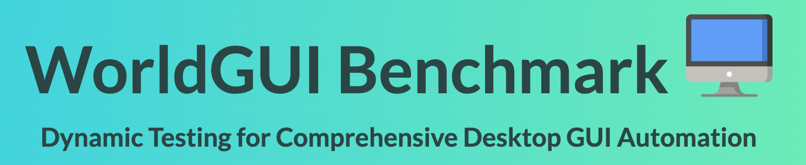
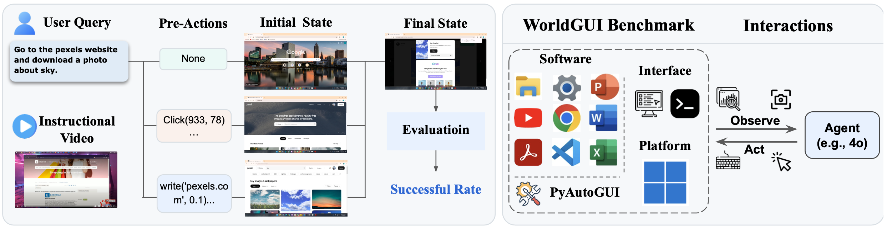
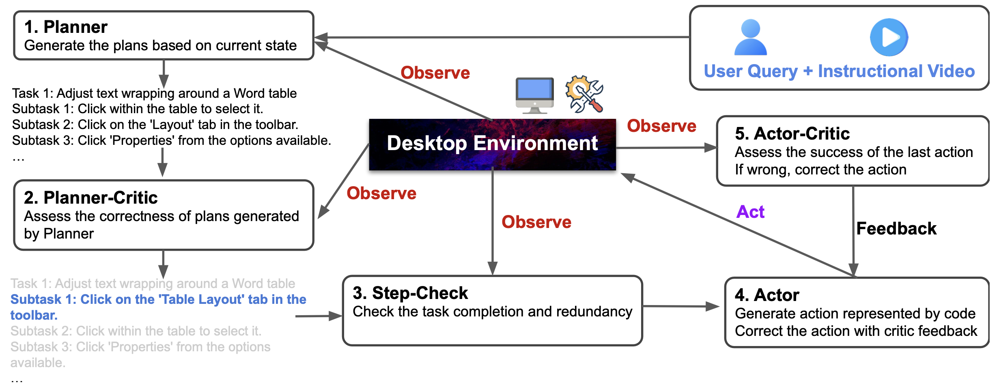

<p align="center">

  <!-- <h1 align="center">WorldGUI: Dynamic Testing for Comprehensive Desktop GUI Automation</h1> -->
  
  <p align="center">
    <a href="https://zhaohengyuan1.github.io"><strong>Henry Hengyuan Zhao</strong></a>
    ·
    <a href="https://scholar.google.com/citations?user=No9OsocAAAAJ&hl=en"><strong>Difei Gao</strong></a>
    ·
    <a href="https://sites.google.com/view/showlab"><strong>Mike Zheng Shou</strong></a>
    <br>
    <br>
        <a href="https://arxiv.org/abs/2502.08047"></a>
        <a href='https://showlab.github.io/WorldGUI'></a>
    </br>
    <br>
    <b>Show Lab, National University of Singapore </b>
    </br>
  </p>

</p>

<!-- ## Abstract -->


## 📢 Update
* [23/02/2025] We will release agent GUI-Thinker (Claude-3.5.-Sonnet) soon.
* [13/02/2025] We release the WorldGUI in [Arxiv](https://arxiv.org/pdf/2502.08047).


## Benchmark Overview

<p align="center"></p>

<b>WorldGUI</b>: An illustration of our proposed real-world GUI benchmark. The left shows that for each task, WorldGUI provides a user query, instructional video, and pre-actions. The pre-actions lead to different initial states. The key characteristic of our WorldGUI is the various initial states of the same task to stimulate the real-world testing process. The right shows the software included in our benchmark and the interactions about testing the agents in our GUI environment.

## Agent Framework Overview

<p align="center"></p>

An overview of <b>GUI-Thinker</b>, includes five proposed components: Planner, Planner-Critic, Step-Check, Actor, and Actor-Critic. The Planner module receives the user query and an instructional video as input and generates an initial plan for the Planner-Critic process. This plan is then refined and executed step by step. Before each step is passed to the Actor module, it undergoes a Step-Check. After the Actor produces an action, the Actor-Critic module iteratively verifies the completion of the action and makes corrections if needed.

## 🙏 Acknowledgement

- We express our great thanks to Kaiming Yang, Mingyi Yan, Wendi Yu for their hard work for data ananotation and baseline testing.

- [OOTB (Computer Use)](https://github.com/showlab/computer_use_ootb?tab=readme-ov-file): Computer Use OOTB is an out-of-the-box (OOTB) solution for Desktop GUI Agent, including API-based (Claude 3.5 Computer Use) and locally-running models (ShowUI, UI-TARS).

- [ShowUI](https://github.com/showlab/ShowUI): Open-source, End-to-end, Lightweight, Vision-Language-Action model for GUI Agent & Computer Use.

- [AssistGUI](https://arxiv.org/pdf/2312.13108): AssistGUI is the first work that focuses on desktop productivity software usage with over 100 realistic GUI tasks.

- [VideoGUI](https://github.com/showlab/videogui): A Benchmark for GUI Automation from Instructional Videos. Can a GUI agent behave like a human when giving an image-style effect and a user query?


- [SWE-bench Multimodal](https://www.swebench.com/multimodal.html): SWE-bench Multimodal is a dataset for evaluating AI systems on visual software engineering tasks.

## 🎓 Citation

If you find WorldGUI useful, please cite using this BibTeX:

```bibtex
@misc{zhao2025worldguidynamictestingcomprehensive,
      title={WorldGUI: Dynamic Testing for Comprehensive Desktop GUI Automation}, 
      author={Henry Hengyuan Zhao and Difei Gao and Mike Zheng Shou},
      year={2025},
      eprint={2502.08047},
      archivePrefix={arXiv},
      primaryClass={cs.AI},
      url={https://arxiv.org/abs/2502.08047}, 
}
```
